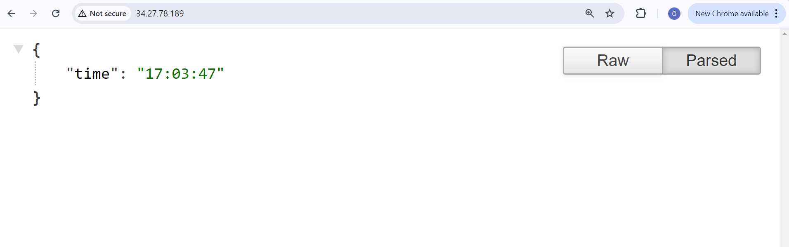

# Deploy GKE Cluster

Google Kubernetes Engine is a managed kunbernetes service by google. The repository consists of the infrasture code using terraform, application code using javascript and k8s configuration files both in helm chart and manifest files.

The terraform code is configured to run some precommit hooks before it is commited to repository to make sure that there is some level of consistency in the code and also to automatically generate terraform [documentation](infrastructure/README.md)

After pushing the code the there is pipeline that automatically builds the docker image and pushes it to the docker hub after which the pipeline that deploys the resources and kubernetes files will then run to deploy the application.

After the succesful run of the application the api can be tested on a browser using a public IP address from the cluster

    

